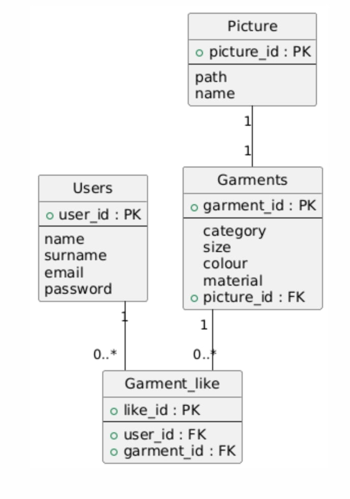
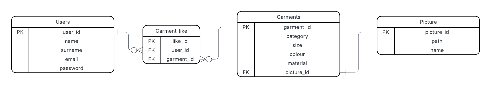

We have made design decisions based on the businees rules we have created in milestone 1.
We have ensured that our primary keys, foreign keys are correctly selected.
We have thought about the relations between entities.
We have added a bridge table resolving a relationship between users and garments.
We have created a UML diagram.

We have created an ERD diagram.

